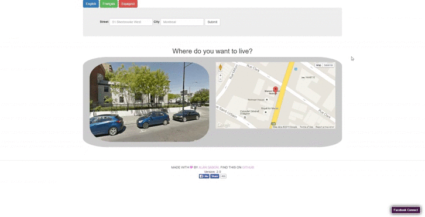

# move-planer2

Bazinga! :boom::boom::boom:

This is an upgrade for the [former project of mine](https://github.com/alireza-saberi/move-planner), in [Udacity front-end Nanodegree](https://www.udacity.com/course/front-end-web-developer-nanodegree--nd001).
Weather information,Google geolocation API , Google Map, Social Media buttons, and translation in three languages is added. The whole codes are refacoted in AngularJs framework.
It has no aim excpet interview.

Basically the user enter street address and city name. and the output will be:

- An image from address
- Googe map pined added on the map
- Today weather information for the location.
- Wikipedia information about location.
- New York Times data about location 

User can like/share the page on Facebook. and view the page in English, French, and Spanish.

### Demo

### APIs and technologies:

- Bootstrap: to make it responsive
- [Google Street View Image API](https://developers.google.com/maps/documentation/streetview/intro): the easy one
- [Google geolocation API](https://developers.google.com/maps/documentation/geocoding/intro): It get street address and return log-lat information required by Map
- [GoogleMap AngularJS Directive](http://ngmap.github.io/): It provides pined map canvase.
- [Open Weather API](http://openweathermap.org/api): is used to get today weather information of the location.
- [NYtime API](http://developer.nytimes.com/docs): You need and API key to use it.
- [MediaWiki API](https://www.mediawiki.org/wiki/API:Main_page): JSONP is used to turn around cross-origin problem.
- [ng-translate](https://angular-translate.github.io/): The magical and exciting part(first experience with i18n things!), through [ng-newsletter](http://www.ng-newsletter.com/posts/angular-translate.html)
- [Facebook social media plug-in](https://developers.facebook.com/docs/plugins)
